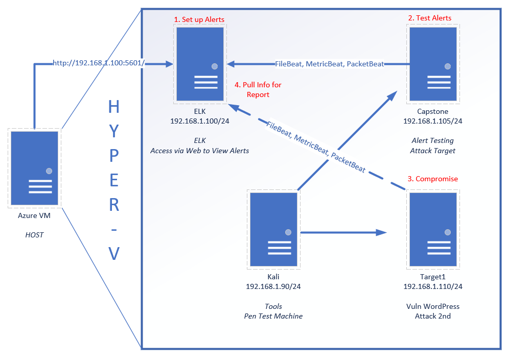

# Unit 24: Final Project README

|ITEM|DESCRIPTION|
|---|---|
|Name|Pieter Booysen|
|Date|30/05/2022|
|Title|Final Project Submission for Cyber Security Bootcamp

## Unit Description

In this project, you will act as a security engineer supporting an organization's SOC infrastructure. The SOC analysts have noticed some discrepancies with alerting in the Kibana system and the manager has asked the security engineering team to investigate and confirm that newly created alerts are working. 

If the alerts are working, you will then monitor live traffic on the wire to detect any abnormalities that aren't reflected in the alerting system. Then, you will report back your findings to the manager with appropriate analysis.

## Deliverables

The following reports are submitted as a result of the investigation.

### [LINK: Network Forensics Analysis Report](/24-Final-Project/_PieterBooysen-Network%20Analysis%20Report.docx)

**Network Forensics**: Use Wireshark to analyze live malicious traffic on the wire.

You are working as a Security Engineer for X-CORP, supporting the SOC infrastructure. The SOC analysts have noticed some discrepancies with alerting in the Kibana system and the manager has asked the Security Engineering team to investigate.

Yesterday, your team confirmed that newly created alerts are working. Today, you will monitor live traffic on the wire to detect any abnormalities that aren't reflected in the alerting system.

You are to report back all your findings to both the SOC manager and the Engineering Manager with appropriate analysis.

The Security team requested this analysis because they have evidence that people are misusing the network. Specifically, they've received tips about:

- "Time thieves" spotted watching YouTube during work hours.
- At least one Windows host infected with a virus.
- Illegal downloads.

A number of machines from foreign subnets are sending traffic to this network. Your task is to collect evidence confirming the Security team's intelligence.

### [LINK: Red Team: Offensive Analysis Report](/24-Final-Project/_PieterBooysen-OffensiveReport.md)
    
**Offensive Security**: Assess a vulnerable VM and verify that the Kibana rules work as expected.

### [LINK: Blue Team: Defensive Analysis Report](/24-Final-Project/_PieterBooysen-DefensiveReport.md)

**Defensive Security**: Implement alerts and thresholds

## Lab Environment

**NOTE: PLEASE REFER TO THE OFFENSIVE OR DEFENSIVE ANALYSIS REPORTS FOR A MORE DETAILED NETWORK DIAGRAM**

Web Vulns lab environment located in Windows Azure Lab Services. RDP into the **Windows RDP host machine** using the following credentials:

  - Username: `azadmin`
  - Password: `p4ssw0rd*`

This is a diagram of the network and the machines that will be used in this lab:

**Azure VM Host**

Azure Host system information:

|Key Network Information|Detail|
|---|---|
|   Host Name . . . . . . . . . . . . :| ML-RefVm-684427|
|Ethernet adapter Ethernet 4:||
|   Description . . . . . . . . . . . :| Microsoft Hyper-V Network Adapter #4|
|   Physical Address. . . . . . . . . :| 00-22-48-69-36-2E|
|   Link-local IPv6 Address . . . . . :| fe80::4520:6fac:7ee:63a7%4(Preferred)|
|   IPv4 Address. . . . . . . . . . . :| 10.0.0.42(Preferred)|
|   Subnet Mask . . . . . . . . . . . :| 255.255.240.0|
|   Default Gateway . . . . . . . . . :| 10.0.0.1|
|   DNS Servers . . . . . . . . . . . :| 168.63.129.16|
|Ethernet adapter vEthernet (NATSwitch):||
|   Description . . . . . . . . . . . :| Hyper-V Virtual Ethernet Adapter #2|
|   Physical Address. . . . . . . . . :| 00-15-5D-00-04-0D|
|   Link-local IPv6 Address . . . . . :| fe80::90ca:742e:54ed:7bb7%13(Preferred)|
|   IPv4 Address. . . . . . . . . . . :| 192.168.1.1(Preferred)|
|   Subnet Mask . . . . . . . . . . . :| 255.255.255.0|
|Ethernet adapter vEthernet (Default Switch):||
|   Description . . . . . . . . . . . :| Hyper-V Virtual Ethernet Adapter|
|   Physical Address. . . . . . . . . :| 00-15-5D-DD-68-20|
|   Link-local IPv6 Address . . . . . :| fe80::a96e:b358:4547:4917%14(Preferred)|
|   IPv4 Address. . . . . . . . . . . :| 172.17.16.1(Preferred)|
|   Subnet Mask . . . . . . . . . . . :| 255.255.240.0|

|Service Information|Detail|||
|---|---|---|---|
|Command|nmap -sV 192.168.1.1|||
|PORT     |STATE |SERVICE       |VERSION|
|135/tcp  |open  |msrpc         |Microsoft Windows RPC|
|139/tcp  |open  |netbios-ssn   |Microsoft Windows netbios-ssn|
|445/tcp  |open  |microsoft-ds?||
|2179/tcp |open  |vmrdp?||
|3389/tcp |open  |ms-wbt-server |Microsoft Terminal Services|
|MAC Address: |00:15:5D:00:04:0D |(Microsoft)||
|Service Info: |OS: Windows; |CPE: cpe:/o:microsoft:windows||

Open the Hyper-V Manager to access the nested machines:

**ELK machine credentials:** The same ELK setup that you created in Project 1. It holds the Kibana dashboards.
- Username: `vagrant`
- Password: `vagrant`
- IP Address: `192.168.1.100`

|Service Information|Detail|||
|---|---|---|---|
|Command|nmap -sV 192.168.1.100||
|PORT     |STATE |SERVICE |VERSION|
|22/tcp   |open  |ssh     |OpenSSH 7.6p1 Ubuntu 4ubuntu0.3 (Ubuntu Linux; protocol 2.0)|
|9200/tcp |open  |http    |Elasticsearch REST API 7.6.1 (name: elk; cluster: elasticsearch; Lucene 8.4.0)|
|MAC Address: |4C:EB:42:D2:D5:D7 |(Intel Corporate)||
|Service Info: |OS: Linux; |CPE: cpe:/o:linux:linux_kernel||

**Kali:** A standard Kali Linux machine for use in the penetration tests. 
- Username: `root`
- Password: `toor`
- IP Address: `192.168.1.90`

|Service Information|Detail|||
|---|---|---|---|
|Command|nmap -sV 192.168.1.90||
|PORT   |STATE |SERVICE |VERSION|
|22/tcp |open  |ssh     |OpenSSH 8.1p1 Debian 5 (protocol 2.0)|
|Service Info: |OS: Linux; |CPE: cpe:/o:linux:linux_kernel||

**Capstone:** Filebeat and Metricbeat are installed and will forward logs to the ELK machine. 
- IP Address: `192.168.1.105`
   - Please note that this VM is in the network solely for the purpose of testing alerts.

|Service Information|Detail|||
|---|---|---|---|
|Command| nmap -sV 192.168.1.105|||
|PORT   |STATE |SERVICE |VERSION|
|22/tcp |open  |ssh     |OpenSSH 7.6p1 Ubuntu 4ubuntu0.3 (Ubuntu Linux; protocol 2.0)|
|80/tcp |open  |http    |Apache httpd 2.4.29|
|MAC Address: |00:15:5D:00:04:0F |(Microsoft)||
|Service Info: |Host: 192.168.1.105; |OS: Linux; |CPE: cpe:/o:linux:linux_kernel|

**Target 1:** Exposes a vulnerable WordPress server.
- IP Address: `192.168.1.110`

|Service Information|Detail|||
|---|---|---|---|
|Command| nmap -sV 192.168.1.110|||
|PORT    |STATE |SERVICE|VERSION
|22/tcp  |open  |ssh         |OpenSSH 6.7p1 Debian 5+deb8u4 (protocol 2.0)|
|80/tcp  |open  |http        |Apache httpd 2.4.10 ((Debian))|
|111/tcp |open  |rpcbind     |2-4 (RPC #100000)|
|139/tcp |open  |netbios-ssn |Samba smbd 3.X - 4.X (workgroup: WORKGROUP)|
|445/tcp |open  |netbios-ssn |Samba smbd 3.X - 4.X (workgroup: WORKGROUP)|
|MAC Address: |00:15:5D:00:04:10 |(Microsoft)||
|Service Info: |Host: TARGET1; |OS: Linux; |CPE: cpe:/o:linux:linux_kernel|

Setting up the Kibana requires a few commands:

- Escalate to root `sudo -s`
- Setup up Apache and Kibana (Filebeat, Metricbeat, and Packetbeat) and system dashboards with a provided script `/opt/setup`

**Target 2:** A `bonus` target machine. A more difficult WordPress target. Sends logs to ELK.
- IP Address: `192.168.1.115`

|Service Information|Detail|||
|---|---|---|---|
|Command|nmap -sV 192.168.1.115|||
|PORT    |STATE |SERVICE     |VERSION|
|22/tcp  |open  |ssh         |OpenSSH 6.7p1 Debian 5+deb8u4 (protocol 2.0)|
|80/tcp  |open  |http        |Apache httpd 2.4.10 ((Debian))|
|111/tcp |open  |rpcbind     |2-4 (RPC #100000)|
|139/tcp |open  |netbios-ssn |Samba smbd 3.X - 4.X (workgroup: WORKGROUP)|
|445/tcp |open  |netbios-ssn |Samba smbd 3.X - 4.X (workgroup: WORKGROUP)|
|MAC Address: |00:15:5D:00:04:11 |(Microsoft)||
|Service Info: |Host: TARGET2; |OS: Linux; |CPE: cpe:/o:linux:linux_kernel|

**What to Be Aware Of during the setup process**

It is common to encounter to experience the following issue:

* If students encounter this error, explain that Kibana needs time to finish setting up. They should wait five to ten minutes and then try again. 

* If the issue is still not resolved, ask to students to log into the ELK machine using the machines credentials and run the following commands:

    - `sudo su` which will allow the student to become the root user. 
    - `docker container ls` to find the name of the running docker container. 
    - `docker container stop <container-name>` which will stop the docker container.
    - `docker container start <container-name>` which will start the docker container back up.

* When setting alerts in Kibana to send log messages, those messages will not show in Kibana without additional configuration. Instead, the status of alerts can be viewed from the 'Watcher' page where the alerts are created.

## Additional Reading and Resources

These resources are provided as optional, recommended resources to supplement the concepts covered in this unit.

- [SANS Pentesting Cheatsheet](https://www.sans.org/blog/sans-poster-building-a-better-pen-tester-pdf-download/)

### Reference Sheets

Collection of useful reference sheets.

1. [cURL Reference Sheet](/ReferenceSheets/cURL_Reference.md)
1. [HTTP Reference Sheet](/ReferenceSheets/HTTP_Reference.md)

---

© 2020 Trilogy Education Services, a 2U, Inc. brand. All Rights Reserved.
